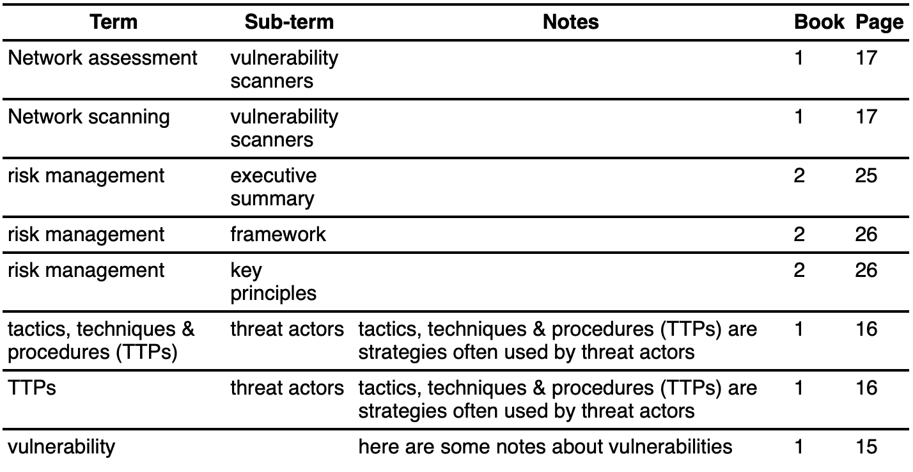

# Exam Index Creator

A Javascript web app for transforming a Markdown table into a multi-sorted, printable, HTML table output.

I created this so I could feed it my Markdown notes from the SANS course books and return a simple but presentable output, ready to take GIAC exams.

Currently requires a Markdown table formatted as:

```
|term|sub-term|notes|book|page|
|---|---|---|---|---|
|a|b|c|1|1|
```

It includes some shortcut rules and shorthand replacement syntax.

- Enter only `term` for a row: copy `book` and `page` from previous row
- Enter only `term*`/`term *` for a row: copy all other fields from previous row (where one concept might have multiple lookup names)
- Enter only `sub-term` for a row: copy `term`, `book` and `page` from previous row
- A blank row won't error, it'll copy `term`, `book` and `page` from previous row
- Define shorthand/replacement terms:
  - Caret (^) separated terms. E.g.:
  - vuln^vulnerability
  - vulnmgt^"vulnerability management"
  - "pen test"^pentest (I can't think of a better example for multi-word in, 1 word out)
  - single or double quotes for multiple word groups
  - terms to be replaced don't partially match words. I.e. vuln isn't matched within vulnmgt
  - terms can be defined in any text field as part of a string, or within a comment row
  - multiple terms can be defined in the same field
  - an instance of a replacement can be escaped by starting it with `!`
- `?` is a comment row - start a row/`term` field with `?` and it won't be displayed in the output. Replacements CAN be defined in this row.

Example input:

```
| term                      | sub-term         | notes                                           | book | page |
|---------------------------|------------------|-------------------------------------------------|------|------|
| ? vuln^vulnerability vulns^vulnerabilities|  | This row is a comment and won't be displayed    |      |      |
| ? riskman^'risk management'|                 | ttps^"tactics, techniques & procedures (TTPs)"  |      |      |
| vuln                      |                  | here are some notes about vulns                 | 1    | 15   |
| ttps                      | threat actors    | ttps are strategies often used by threat actors |      | 16   |
| !TTPs*                    |                  |                                                 |      |      |
| Network assessment        | vuln scanners    |                                                 |      | 17   |
| Network scanning*         |                  |                                                 |      |      |
| riskman                   | executive summary|                                                 | 2    | 25   |
|                           | framework        |                                                 |      | 26   |
|                           | key principles   |                                                 |      |      |

Note: The replacements can be in one or many commented-out lines. Split into 2 above for display reasons.
```

Example output:



## Usage

Clone/download the repo and run index.html. It runs as a local file without needing a web server.

**Can you currently use it to create an index?** The output can be copied cleanly into Excel, but in future, this should render/be printable from HTML.

This is very rough. In the extremely likely event of errors, check the browser console log to see what it happening. Feel free to create an issue, but please understand that there should be no expectation of support. An issue that contains your input, output (if any), and entries from the console is much more likely to be checked and responded to.

Note: Before pasting your index into an issue, try to recreate the issue with minimal/different content, unless your are happy sharing your work (and your index does not contain direct quotes from any third-party copyrighted material).

## Ideas/TODO

- double \*\* to indicate the line should be repeated, but term and sub-term swapped
- run without table headers, but assume the correct input order
- detect csv, tsv, pasted from excel
- better table formatting (tables can _always_ be formatted better)
- if: multiple lines with same term, different sub-terms -> Collapse term
- Index title, subtitle, image for header/cover page. _Presentation is key_
- print options (use JS to allow only index part of page to be printed)
- Save as PDF
- if: row has term and notes, but no subterm -> collapse sub-term into longer notes field
- Row separator, where anything below the separator is processed as separate content. I.e. code examples for labs might be at bottom.
- Shorthand replacement if first letter capialised, capitalise replacement
- Allow JS file to accept command line arguments, and output data/PDF/etc.
